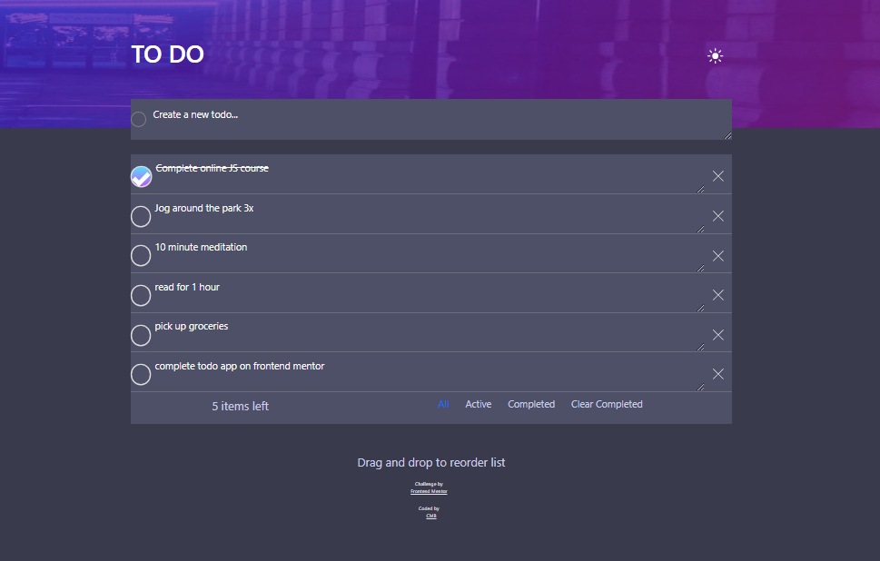

# Frontend Mentor - Todo app solution

This is a solution to the [Todo app challenge on Frontend Mentor](https://www.frontendmentor.io/challenges/todo-app-Su1_KokOW). Frontend Mentor challenges help you improve your coding skills by building realistic projects. 

## Table of contents

- [Overview](#overview)
  - [The challenge](#the-challenge)
  - [Screenshot](#screenshot)
  - [Links](#links)
- [My process](#my-process)
  - [Built with](#built-with)
  - [What I learned](#what-i-learned)
  - [Continued development](#continued-development)
  - [Useful resources](#useful-resources)
- [Author](#author)
- [Acknowledgments](#acknowledgments)

**Note: Delete this note and update the table of contents based on what sections you keep.**

## Overview

### The challenge

Users should be able to:

- View the optimal layout for the app depending on their device's screen size
- See hover states for all interactive elements on the page
- Add new todos to the list
- Mark todos as complete
- Delete todos from the list
- Filter by all/active/complete todos
- Clear all completed todos
- Toggle light and dark mode
- **Bonus**: Drag and drop to reorder items on the list

### Screenshot

### Links

- Solution URL: [Github](https://github.com/cmb347827/todo-app-main)
- Live Site URL: [Live Github](https://cmb347827.github.io/todo-app-main/)

## My process

### Built with

- Semantic HTML5 markup
- Sass/SCSS
- Bootstrap
- jQuery/Javascript
- Mobile-first workflow

### What I learned
  - Had the purple background set for the main element at first, but I could not get that to look right as it kept growing with the form content. When I changed it to apply to the header element it worked.
  -I fulfilled all requirements , including the bonus. I also added an error message when a user tries to add a blank task, as well as the ability to save updated tasks that are already in the list, also number of 'items left' gets updated when a user checks/unchecks a task, also completed tasks strike through immediately.
  - I learned the usefull use of js filter()
  - I have also followed an Amazon tutorial project which helped with localStorage use understanding (project is also in my github profile)
  - At first I had to use JS to add the striked out text for completed tasks (see WhichStyle code in updatetaskcontainer and textarea code in setRemoveChecked ), but figured out how to do this using SCSS only (lines 70-80)
  - I needed to apply the gradient border for the `input[type='checkbox']` on hover, and remembered that I used this before in a previous project.
    I could use the same technique here.
  - I wasn't sure if it was the idea that dragging and dropping would also save the new order, but drag/drop works at least. I tried saving drag/drop with a tutorial , but it does not seem to work.
  - I learned about e.currentTarget.parentElement from a stackoverflow post (can't find the post as I forgot to bookmark it) , and that was most helpful for me being able to finish this project.  I'm also now learning in a freecodecamp tutorial about event.target/e.target , which seems even simpler.
   

### Continued development

- Daily tutorials and projects in HTML5, CSS3, Javascript, Bootstrap, Sass/SCSS. For now, in time I will go re-learn React ect.

### Useful resources

[how to make checkboxes round](https://stackoverflow.com/questions/29617200/how-to-make-checkboxes-rounded)

[gradient borders](https://codyhouse.co/nuggets/css-gradient-borders)

[drap drop in sortable.js](https://www.ma-no.org/en/programming/javascript/sorting-elements-with-sortablejs-and-storing-them-in-localstorage)

## Author

- Website - [One of my latest codepens](https://codepen.io/cynthiab72/pen/oNybYON)
- Frontend Mentor - [@cmb347827](https://www.frontendmentor.io/profile/cmb347827)

